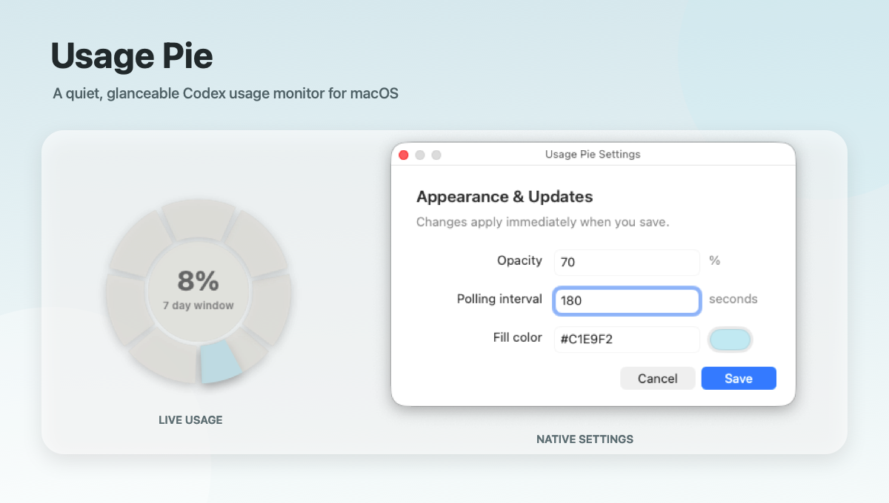

# Usage Pie

Usage Pie is a tiny, draggable macOS usage monitor for Codex, DeepInfra, and
DeepSeek. It displays account usage as a transparent, borderless pie.



## Features

- Native macOS interface built with Swift and AppKit
- Transparent, borderless, always-on-top window
- Menu-bar icon with live usage statistics on hover
- Drag from anywhere and remember the last window position
- Divide the usage window into equal daily sections
- Switch between Codex usage and DeepInfra's rolling 30-day billing usage
- Show DeepSeek prepaid usage as one continuous used/remaining ring
- Show current usage percentage and window duration in the pie
- Keep the reset date in the menu and menu-bar hover statistics
- Poll automatically at a configurable interval while the widget is visible
- Refresh stale usage when the menu-bar icon is hovered or opened
- Matching menus from the menu bar or a right-click on the pie
- Open settings, show or hide the pie, and run automatically at login
- Custom app icon and drag-to-Applications DMG installer
- Read usage without storing browser cookies or account credentials

## Requirements

- macOS 13 or later
- Apple Swift toolchain or Xcode Command Line Tools
- Node.js
- Codex CLI or the ChatGPT app, signed in to a Codex-enabled account

## Run

Build and launch the widget:

```sh
./run-widget.sh
```

Build the app without launching it:

```sh
./build-widget.sh
```

The generated application is `Usage Pie.app`.

Build a distributable installer:

```sh
./build-installer.sh
```

The installer is written to `dist/Usage Pie.dmg`. Open it and drag
**Usage Pie** into **Applications**.

To retrieve the same usage information as JSON without opening the widget:

```sh
./codex-usage.mjs
```

## Settings

Choose **Settings…** from either the menu-bar icon or the pie’s right-click
menu to open the lightweight settings editor. It provides fields for opacity,
polling interval, and fill color; changes apply as soon as you click **Save**.

The editor stores these values in the selected source's JSON file:

```json
{
  "opacity": 0.70,
  "pollIntervalSeconds": 300,
  "fillColor": "#C1E9F2"
}
```

- The editor’s opacity field accepts `5` through `100` percent; JSON stores
  the equivalent value from `0.05` through `1.0`.
- `pollIntervalSeconds` controls how often usage is checked and has a minimum
  value of 60 seconds. Automatic polling pauses while the widget is hidden;
  hovering or opening the menu-bar icon refreshes data once this interval has
  elapsed since the previous refresh.
- `fillColor` accepts a CSS-style `#RRGGBB` or `#RRGGBBAA` hex color.

You can still edit [`usage-pie.settings.json`](usage-pie.settings.json) for
Codex, [`infra.settings.json`](infra.settings.json) for Infra, or
[`deepseek.settings.json`](deepseek.settings.json) for DeepSeek directly. After
a manual edit, choose **Reload Settings**, or relaunch the app.

When the installed app creates a personal configuration, it stores it at
`~/Library/Application Support/Usage Pie/` using the corresponding filename.

Choose **Source → Infra** to show the last 30 days of DeepInfra spending. The
configured DeepInfra monthly spending limit is treated as 100%, and the menu
shows dollars spent and remaining. DeepInfra's usage API reports costs in cents;
the Infra reader converts them to dollars before comparing them with the
configured dollar limit. Infra reads `DEEPINFRA_TOKEN` and optionally
`DEEPINFRA_BASE_URL` from the app environment. When `DEEPINFRA_TOKEN` is not
set, the app reads the existing `deepinfra-api-key` Keychain item.

Choose **Source → DeepSeek** to show a single continuous balance ring. In
**DeepSeek Settings**, set **Initial top-up** to the account's starting balance,
using the same currency as the balance returned for your account. The widget
subtracts the current balance from that amount to show used and
remaining percentages. DeepSeek's public API only returns the current balance,
so this setting establishes the original total. DeepSeek reads
`DEEPSEEK_API_KEY` and optionally `DEEPSEEK_BASE_URL` from the app environment.
When `DEEPSEEK_API_KEY` is not set, the app reads the existing
`deepseek-api-key` Keychain item.

You can override executable, script, and settings locations with `CODEX_BIN`,
`NODE_BIN`, `CODEX_USAGE_SCRIPT`, `USAGE_PIE_SETTINGS`,
`INFRA_USAGE_SCRIPT`, `INFRA_USAGE_SETTINGS`, `DEEPSEEK_USAGE_SCRIPT`, and
`DEEPSEEK_USAGE_SETTINGS`.

## Project layout

- `UsagePie.swift` — native window, chart, polling, and settings
- `IconRenderer.swift` — generates the multi-resolution macOS app icon
- `codex-usage.mjs` — one-shot Codex usage reader
- `infra-usage.mjs` — one-shot DeepInfra billing reader
- `deepseek-usage.mjs` — one-shot DeepSeek balance reader
- `usage-pie.settings.json` — user-editable widget configuration
- `infra.settings.json` — user-editable Infra appearance configuration
- `deepseek.settings.json` — user-editable DeepSeek balance and appearance configuration
- `build-widget.sh` — creates the macOS app bundle
- `build-installer.sh` — creates the distributable DMG installer
- `run-widget.sh` — builds and launches the widget

## License

Copyright © 2026 Shane Reilly.

Usage Pie is free software licensed under the GNU General Public License,
version 3 or any later version. See [`LICENSE`](LICENSE) for the complete terms.
